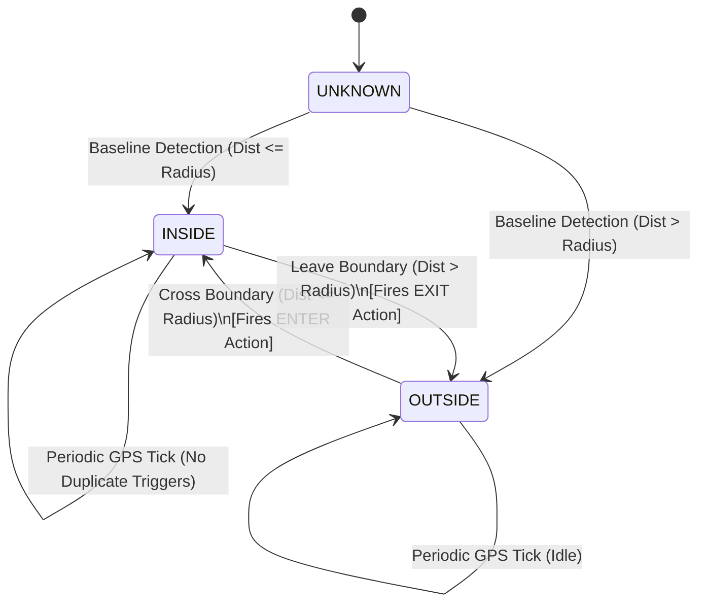

<div align="center">

  

  # GeoBuzz
  ### **"Your phone knows where you are. GeoBuzz knows what to do."**
  
  [](https://flutter.dev)
  [](https://android.com)
  [](https://nodejs.org)
  [](https://mongodb.com)
  [](LICENSE)

  <p align="center">
    <strong>GeoBuzz</strong> is a commercial-grade, multi-platform location automation system that transforms physical coordinates into intelligent device triggers. Automatically switch sound profiles, ring loud proximity alarms, send arrival reminders, and trigger hardware toggles upon crossing geofence boundaries.
  </p>

  <p align="center">
    <a href="#-key-features">Features</a> •
    <a href="#-architecture--state-machine">Architecture</a> •
    <a href="#-design-system--uiux">UI/UX Showcase</a> •
    <a href="#-getting-started">Getting Started</a> •
    <a href="#-api-endpoints">API Documentation</a> •
    <a href="#-tech-stack">Tech Stack</a>
  </p>
</div>

---

## ⚡ Real-World Automation Examples

| Physical Location | Geofence Radius | Event Trigger | Automated Device Action |
|:---|:---:|:---:|:---|
| **College / University** | `100m` | **ENTER** | 🔕 Switches phone to **Silent Mode** automatically |
| **Office / Workplace** | `75m` | **ENTER + EXIT** | 📳 **Vibrate Mode** on arrival ➔ 🔔 **Normal Mode** on departure |
| **Transit / Bus Stop** | `150m` | **NEAR / ENTER** | 🚨 Rings a loud **15-second Location Alarm** so you never miss your stop |
| **Supermarket** | `50m` | **ENTER** | 📝 Pops a custom reminder notification: *"Buy milk & groceries"* |
| **Home** | `40m` | **EXIT** | 📶 Prompts WiFi & Bluetooth power-saving action upon leaving |

---

## 🌟 Key Features

### 🎯 1. Ultra-Low Power Geofence Evaluation Engine
* **Adaptive Distance Filtering**: Calculates Euclidean/Haversine spherical distances with sub-millisecond in-memory caching.
* **Accuracy Outlier Rejection**: Discards GPS noise and multipath reflections (`> 65m` error rejected on mobile, adaptive IP accuracy on web).
* **Discrete State-Machine Transitions**: Implements strict `OUTSIDE ➔ ENTER ➔ INSIDE ➔ EXIT ➔ OUTSIDE` state machines to eliminate false duplicate triggers.
* **Immediate Baseline Trigger**: Optional switch to fire rules immediately if you are already inside the destination zone upon activation.

### 🔔 2. Location-Based Alarm System
* **Continuous Audio Loop**: Plays attention-grabbing audio tones until auto-timeout or user dismissal.
* **Vibration Pulses**: Native Android hardware vibration pattern sync.
* **Floating Dismiss Banner**: Interactive banner overlay that appears at the top of the UI during active alarms.
* **One-Click Instant Simulation**: Built-in `▶ Test Trigger` buttons for rapid desk-testing without physical movement.

### 🔕 3. Native Sound Profile Automation (DND & Audio Manager)
* **Native Android MethodChannels**: Directly commands Android `AudioManager` and `NotificationManager`.
* **State Preservation & Restoration**: Records pre-existing sound mode before silencing and restores it faithfully upon exit.
* **Do Not Disturb (DND) Policy Access**: Guides users directly to system settings for policy grant.

### 🗺️ 4. Interactive Live Radar & Map Visualizer
* **Full-Canvas OpenStreetMap**: Renders all configured geofences and active markers simultaneously with live pulse markers.
* **Dynamic Radius Visualizer**: Real-time slider adjustments from `20m` up to `2000m` with instant visual circle updates.
* **Nominatim Reverse Geocoding**: Search for any city, landmark, or address worldwide with autocomplete pin-drop.

### 📊 5. Audit History & Local-First Database
* **Offline-First Persistence**: Powered by SQLite (`sqflite`) for zero-latency local rules, state tracking, and logs.
* **Trigger Activity Log**: Timestamped record of every triggered rule, status (`SUCCESS`/`FAILURE`), distance, and device message.
* **Cloud Sync Engine**: Full Node.js/Express + MongoDB backend sync when online.

---

## 📐 Architecture & State Machine



---

## 💻 Tech Stack

### Mobile & Frontend (Flutter Multi-Platform)
* **Framework**: Flutter 3.x (Android, iOS, Web, Windows Desktop)
* **State Management**: `Provider` + `ValueNotifier` for real-time reactivity
* **Mapping**: `flutter_map` (OpenStreetMap Vector & Tile Engine) + `latlong2`
* **Local Storage**: `sqflite` (SQLite) + in-memory Web fallback
* **Hardware & Audio**: `geolocator`, `audioplayers`, `flutter_local_notifications`, `vibration`
* **Network & Security**: `dio`, `flutter_secure_storage`, `shared_preferences`

### Native Android Layer (Kotlin)
* **Platform Channel**: `com.geobuzz/device_channel`
* **System Services**: `AudioManager`, `NotificationManager`, `ACTION_NOTIFICATION_POLICY_ACCESS_SETTINGS`

### Backend REST API (Node.js & MongoDB)
* **Runtime**: Node.js & Express.js
* **Database**: MongoDB with Mongoose ODM
* **Security**: JWT (`jsonwebtoken`), `bcryptjs` password hashing, `cors`, `dotenv`

---

## 🎨 UI/UX Design System

GeoBuzz features a **Linear & Raycast inspired Obsidian Theme**:

| Token | Hex Code | Purpose |
|:---|:---|:---|
| **Background Dark** | `#080B14` | Deep obsidian near-black canvas |
| **Surface Dark** | `#111827` | Elevated card & sidebar background |
| **Border Dark** | `#1F2937` | Subtle divider & panel borders |
| **Primary Electric** | `#4F46E5` | Core brand color & primary buttons |
| **Cyan Accent** | `#06B6D4` | High-contrast highlights, live badges, and pins |
| **Emerald Success** | `#16A34A` | Active engine status and successful triggers |
| **Amber Warning** | `#F59E0B` | Paused engines and DND alerts |
| **Crimson Error** | `#DC2626` | Active alarms and boundary departures |

---

## 🚀 Getting Started

### Prerequisites
* [Flutter SDK](https://flutter.dev/docs/get-started/install) (`>= 3.3.0`)
* [Node.js](https://nodejs.org/) (`>= 18.x`) & [npm](https://npmjs.com/)
* [MongoDB](https://www.mongodb.com/) (Local instance or MongoDB Atlas)
* [Android Studio / VS Code](https://developer.android.com/studio) with Android SDK

---

### 1. Clone the Repository
```bash
git clone https://github.com/rakshak2005/Geobuzz-App.git
cd Geobuzz-App
```

---

### 2. Run the Flutter Mobile / Web App

```bash
# Navigate to the Flutter project
cd mobile/flutter_app

# Install dependencies
flutter pub get

# Run on Google Chrome (Instant Web Sandbox)
flutter run -d chrome

# OR Run on connected Android Device / Emulator
flutter run -d <device_id>
```

---

### 3. Start the Node.js / MongoDB Backend

```bash
# Navigate to the backend directory
cd backend

# Install npm dependencies
npm install

# Configure environment variables
cp .env.example .env

# Start the development server
npm run dev
```

Your REST API will be live at `http://localhost:5000/api`.

---

## 📡 API Endpoints

### 🔐 Authentication (`/api/auth`)
* `POST /api/auth/register` — Create user account with hashed credentials.
* `POST /api/auth/login` — Authenticate and receive signed JWT.
* `GET /api/auth/me` — Retrieve current authenticated user profile.

### ⚙️ Automation Rules (`/api/rules`)
* `GET /api/rules` — Fetch all user automation rules.
* `POST /api/rules` — Create a new location rule.
* `PUT /api/rules/:id` — Update existing rule configuration.
* `DELETE /api/rules/:id` — Remove an automation rule.
* `PATCH /api/rules/:id/toggle` — Enable or pause rule execution.

### 📜 Execution History (`/api/history`)
* `GET /api/history` — List trigger logs with pagination and filters.
* `POST /api/history` — Record a geofence trigger event.
* `DELETE /api/history` — Clear activity logs.

---

## 🧪 Testing

Execute automated unit, state machine, and smoke tests:

```bash
cd mobile/flutter_app
flutter test
```

Test coverage includes:
* `RuleModel` serialization & deserialization integrity.
* `GeofenceState` discrete state transition validation.
* `SplashScreen` and multi-platform component rendering.

---

## 📄 License
Distributed under the **MIT License**. See `LICENSE` for more details.

---

<div align="center">
  <sub>Built with ❤️ by <strong>Rakshak</strong> and the GeoBuzz Engineering Team.</sub>
</div>
